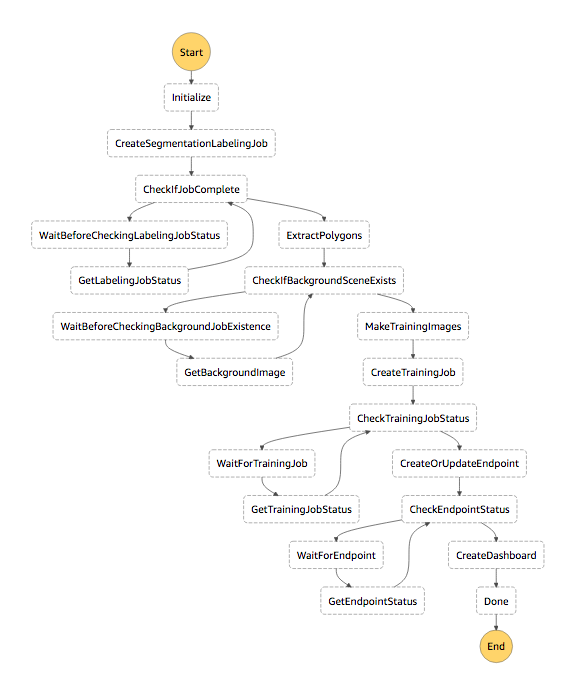

# Custom Object Detection, using Native AWS Services

### Project Description

This project demonstrates how you can set up a custom object detection model and track what objects were removed from a session. A session is a time window when a person is in the camera frame. This shows the basic building blocks for developing computer vision based services for tracking what things are present or not, especially when people are observed.

### Architecture

### AWS Services Used

| Service        | Use           |
|:-------------|:-------------|
| SageMaker, Ground Truth      | Used for drawing polygons around objects to classify. |
| SageMaker, Training Job      | Used to run custom the [custom object detection algorithm](https://docs.aws.amazon.com/sagemaker/latest/dg/object-detection.html) and produce custom models.      | 
| SageMaker, Endpoint | Custom models are deployed as SageMaker endpoints where inference requests are sent.  | 
| StepFunctions | A StepFunction is used to run the end to end workflow of provisioning a custom object detection scene, building the model, and deploying to SageMaker endpoints. It also updates configuration values in SSM Parameter Store. |
| S3 | S3 is used to store scene provisioning work, i.e. input images, generated training images, models, etc. It's also used to store frames captured from DeepLens cameras. |
| Lambda | A Lambda function is deployed to the DeepLens camera to capture video frames when movement is detected. A ImageProcessor function is used to run custom object detection on each frame that is uploaded to S3. A SessionProcessor function is used to continuously look for people, track sessions, and add items to sessions.  |
| CloudWatch | Custom metrics for each object class are used as the record store for observations (confidence levels of custom object classes). This is where the SessionProcessor function gets it's data for analysis. |
| DeepLens | The DeepLens is the camera that is capturing frames when motion is detected. You deploy the lambda fucntion to it via AWS IOT, Greengrass. |
| AWS IOT, Greengrass | This is used to provision the authentication mechanism (certificate) on the DeepLens and initiate the AWS session from the DeepLens. |
| DynamoDB | Sessions are written to a DynamoDB table. |
| CodePipeline | Used to trigger a rebuilding and deployment of code when it's changed. |
| CodeBuild | Builds the soruce code for the StepFunction and Lambdas. |
| CodeCommit | A private git repository is created for you when you launch the CloudFormation template where you can then extend or change the source code. | 
| CloudFormation | Used to deploy the SAM based Lambda functions and he CloudFormation template for the StepFunction and associated Lambdas. |
| Systems Manager | Parmeter Store in SSM is used to store configuration values for each DeepLens device.  |
| IAM | Roles are built for the Lambda Functions and Code tools. |

### Scene Provisioning Workflow

### Install Instructions

Download and install this CloudFormation template: https://raw.githubusercontent.com/aws-samples/amazon-sagemaker-custom-object-detection/master/initialization-template.json

Use the name "cod" (for custom object detection) for the stack name.

That will build a CI/CD pipeline that will copy this github repository into a private CodeCommit repo. 

The pipeline will deploy a Serverless template that creates Lambda functions, as well as a CloudFormation template that deployes a StepFunction and associated Lambda functions.

Create a new version of the Lambda function called something like this:
CustomObjectDetection-DeepLensMotionDetection-DW8KW5ZKPS....

Use the button Actions > Publish New Version > Publish.

Create a DeepLens project, use the "deeplens-object-detection" model and the "CustomObjectDetection-DeepLensMotionDetection-DW8KW5ZKPS...." Lambda for the function.

Deploy project to DeepLens

You need to set 3 properties in SSM Parameter Store:
1. "/scene-provision/WorkteamArn" - this is the Ground Truth workteam ARN. You can create a private team and just add your personal email to be the only working.
2. "/scene-provision/LabelingRoleArn" - this is the role ARN that will be used by the Ground Truth labeling job. Make sure it has access to the bucket you plan to use the scene workspace and the bucket the source images are located in.
3. "/scene-provision/JobWorkspace" - this is the bucket and path you want to use for scene provisioning workspace. Example value: s3://ground-truth-002/scene-provision/

Send a JSON payload to the Step Function that was created:

`
{
  "ClassNames": [ "WhiteWaterBottle", "CoffeeCup", "Trashcan" ],
  "SceneImageLocation": "s3://ground-truth-002/source/office.jpg",
  "SceneBackgroundLocation": "s3://ground-truth-002/source/office-background.jpg",
  "Region": "us-east-1",
  "CameraKey": "deeplens_PiaX2Z4dTQeJG7vG41vVtw"
}
`

Description of properties:
1. ClassNames - these are the classes of objects you want to track. Currently limited to a max of 10.
2. SceneImageLocation - this is the S3 location with the scene that contains the objects you want to track.
3. SceneBackgroundLocation - this the S3 location with the scene background, this should be the same as the scene image location, but with the items you want to track removed from the scene.
4. Region - set this to "us-east-1"
5. CameraKey - this is the DeepLens IOT Thing ID.

This will start a labeling job that you will need to complete. It may take several minutes before the job shows in your private worker queue.

After you submit the segmentation job the Step Function will generate training images, then train a model and host an endpoint. The whole process should take about 30 minutes or less.

Create a trigger for the "ImageProcessor" function. This will be an S3 trigger on the bucket you are sending images to. Event type should be "All object create events". You can add a prefix of "frames" and a suffix of ".jpg". Once the trigger is enabled it will run object detection analytics on images that are uploaded to the S3 bucket.

Once the Step Function completes you can start to view sessions and objects taken from scene can be viewed in a DynamoDB table named "TrackedSessions".

When a person walks into the camera frame a new session will be started, when the person walks out of frame the session will end. If there are not items observed to be taken the session will be deleted. If there are items observed to be taken, they will be added to the session shopping cart.

### SSM Parameters

| Parameter Name        | Required | Example Value | Description           |
|:-------------|:-------------|:---------------|:-----------|
| /Cameras/{deeplenseId}/ObservationBoundingBox | No  | 428,0,993,760 | If you provide this value the lambda function that is looking at camera frames will narrow it's area of observation to just this bounding box. The value represents two points X,Y upper left and X,Y lower right. Concatenate all values together and seperate with a comma. [Example of use in code](/ImageProcessor/Function.cs#L100) After setting this value it needs to propigate to the Lambda function that is processing frames triggered by S3. It will over time once the Lambda infrastructure spins up a new instance of the function, however if you need to force the update you can re-run your CodePipeline project which will deploy a new Lambda which will get your new values. You can search the web for the term "online pixel location in image tool" which should lead you to a tool for finding pixel locations in your background image. |

